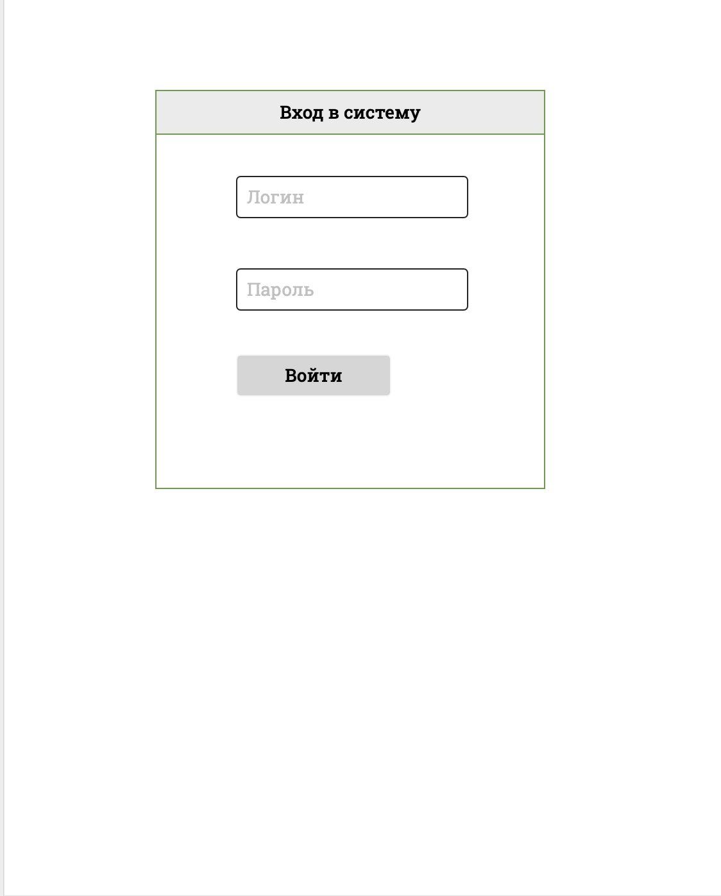

# Регистратура

## Бизнес требования

### Функциональные требования

#### Запись пациента на прием к врачу

Экраны:

1. Страница логина 
2. Выбор специализации врача [screen2]()
3. Выбор отделения поликлиники
4. Выбор доступного временного слота. Отображает дата и время и краткое описание
врача
5. Результат записи:
    - Успешная запись
    - Неудачная запись, кнопка перехода на экран 4.

Описание бизнес-процесса:

1. Вход пользователя в систему
2. Выбор пользователем специальности врача 
3. Выбор отделения пользователем, куда будет идти запись
4. Выбор доступного временного слота пользователем
5. Результат записи. В случае неудачной записи переход на шаг 4.

#### Просмотр списка врачей

Отображаем 

- Аватар врача
- ФИО Врача
- Специальность

#### Просмотр контактов

Отображение отделения клиники

- Фото здания
- Адрес
- Как добраться
- Контактный телефон

#### Просмотр врачом записанных к нему пациентов

Отображаем пациентов, записанных на прием к пользователю системы (с ролью доктор)

- Дату и время приема
- Отделение
- Специальность
- ФИО пациента

#### Возможность отменить прием пациентом

При клике на свои будущие записи к врачу, появляется popup с кнопкой отменить запись. Если пользователь
щелкает на кнопке, то вылезает окошко Вы уверены? Нет Да. Если пользователь кликает нет, окошко с "Вы уверены" 
закрывается. Если он щелкает Да, то закрывается и окошко и popup, запись удаляется

## Техзадание на фронт-енд

1. Сверстать html страницы по предоставленным прототипам
2. Реализовать через jquery функцию записи пациента на прием.
3. При определенном логине и пароле следует переходить на главную страницу
4. Валидация значений при регистрации 
    1. В имени и фамилии только символы Кирилицы
    2. Уникальность логина и длина не менее 5 символов
    3. Идентичность паролей
5. Во время записи при наведении на врача, реализация всплывающего окна, с кратким описанием врача,
   во время записи на прием
6. При нажатии на врача на странице "Наши врачи" pop-up с его описанием и возможностью записи сразу к нему

Экраны:

1. Мои записи
    1. Список записей с пагинацией, сортировкой и поиском с отправкой веб-запросов на бэкенд
    2. Popup с отменой записи
    3. Окошко "Вы уверены" при нажатии кнопки Отмены записи с кнопками Нет Да
    4. В случае при клике на Нет выдавать экран 2
    5. В случае при клике на Да, послать запрос на удаление записи на бэкенд и выдавать экран 1
    6. Мои записи и Popup, исчезающий через 2 секунды, экран появляется после успешной записи пациента на прием
2. Логин и Logout страницы
3. Контакты
4. Наши врачи
5. Записи ко мне
6. Запись на прием (набор экранов)

На каждом экране необходимо иметь меню указанного формата (приложить скетч)

> Мои записи/Записи ко мне, Наши врачи, Контакты, Имя пользователя и кнопка выход

Требование реализации тз по пункту 2 (запись на прием).

- Использовать jquery
- Использовать асинхронный  ajax для обращение к backend'у и синхронный запрос с перезагрузкой страницы

